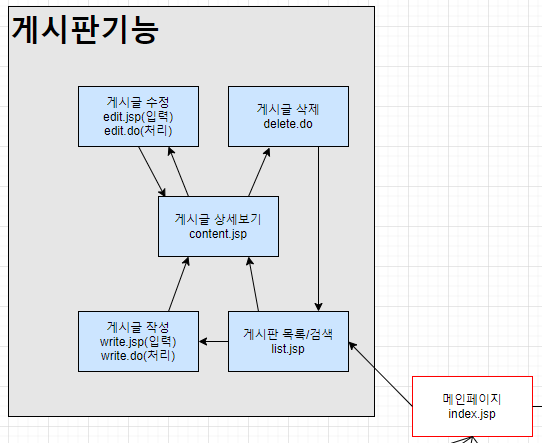

# 게시판 기획

게시판은 `글을 작성하여 공유할 수 있도록 구현된 시스템`을 말합니다.

## 게시판 종류

게시판은 다양한 종류가 있습니다.

- 일반 게시판
- 갤러리 게시판
- SNS 게시판
- 블로그 게시판
- 기타..

우리는 일반 게시판(자유 게시판)을 만들게 됩니다.

## 게시판 흐름(flow)

## 게시판 테이블 구성

게시판은 다음과 같은 구성요소들을 가집니다.

- 글 제목 
- 글 번호
- 글 작성자
- 글 작성일
- 조회수
- 글 내용
- 말머리

각각의 항목들에 대한 특성을 정리하면 다음과 같습니다.

#### table board

- 글 번호(board_no) : 기본키(Primary key) 이며 숫자 시퀀스로 부여(board_seq : 캐시 0)
- 말머리(board_head) : 필수는 아니며 정해진 항목 내에서 설정하도록 구현(정보, 공지, 유머)
- 글 제목(board_title) : 필수 항목이며 한글 100자 이내로 작성
- 글 작성자(board_writer) : 로그인한 회원의 정보(아이디)가 외래키로 설정되며 탈퇴한 사용자의 경우 null로 설정
- 글 내용(board_content) : 필수 항목이며 가장 큰 문자열 형태로 지정(4000 byte)
- 글 작성일(board_date) : 필수 항목이며 현재 시각으로 자동 설정
- 조회수(board_read) : 필수 항목이며 기본값 0으로 설정

## 게시판을 위한 Java Beans 구성

게시판을 만들기 위해 필요한 `DAO`, `DTO`는 다음과 같습니다.

- BoardDao
- BoardDto

## 게시판 페이지 구성

게시판을 만들기 위해 필요한 페이지들은 다음과 같습니다.

- 작성 페이지
	- write.jsp
	- write.do
- 목록/검색 페이지
	- list.jsp
- 상세 페이지
	- content.jsp
- 수정 페이지
	- edit.jsp
	- edit.do
- 삭제 페이지
	- delete.do

